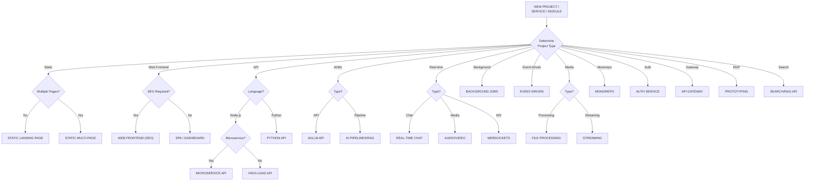
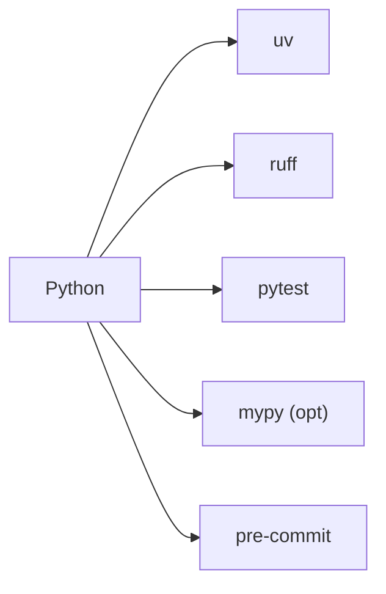
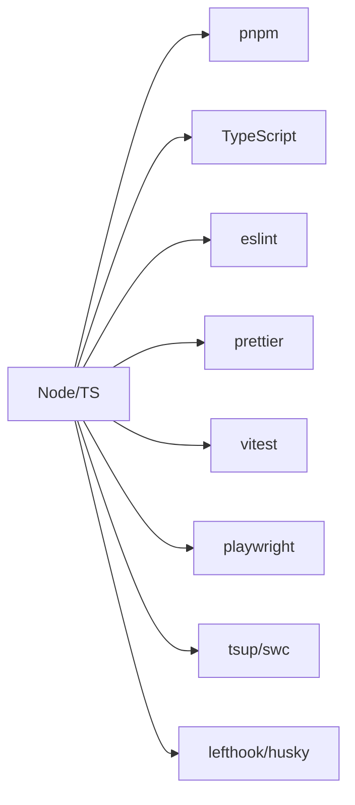

# Tech Stack Selection

> **TL;DR:** When creating a new project, service, or module — select the tech stack STRICTLY based on project type. No guessing, no inventing, no asking. Apply these rules automatically.

## Core Principles

1. Prefer simplicity over complexity.
2. Prefer performance over convenience.
3. Prefer widely adopted tools with strong communities.
4. Do NOT introduce frameworks unless explicitly required.
5. Do NOT over-engineer.
6. Always select the stack based on project type.
7. Always use the latest compatible stable versions.
8. Always include linting, formatting, and testing.
9. Always use Docker for backend services.

## Stack Selection Decision Tree

## Project Type → Required Stack

### Frontend Projects

| Type | Stack |
|------|-------|
| **Static Landing** | HTML, CSS, Tailwind CSS, Alpine.js (opt). NO SPA. Docker optional. |
| **Static Multi-Page** | PHP, HTML, Tailwind CSS. SSR templates. NO SPA. Docker required. |
| **Web Frontend (SEO)** | Next.js, React, Tailwind, shadcn/ui, Vite, pnpm, Vitest, Playwright. Docker. |
| **SPA / Dashboard** | Vite, React or Vue, Tailwind, TanStack Query, Vitest. Docker. |

### Backend API Projects

| Type | Stack |
|------|-------|
| **Microservice API** | Nest.js, Fastify (MANDATORY), PostgreSQL, Prisma, Redis, NATS, Docker Compose. |
| **High-Load HTTP API** | Node.js, Fastify, PostgreSQL, Redis, k6. Docker. |
| **Python API (Modern)** | Python, FastAPI, uvicorn, uv, ruff, pydantic, sqlalchemy, alembic, pytest. Docker. |
| **API Gateway / BFF** | Node.js, Fastify, Zod, OpenAPI. Docker. |

### AI / ML Projects

| Type | Stack |
|------|-------|
| **AI / LLM API** | Python, FastAPI, uv, ruff, OpenAI/OpenRouter SDK, Redis. Docker. |
| **AI Pipelines / RAG** | Python, FastAPI, uv, ruff, LangChain/LlamaIndex, pgvector/Qdrant, Redis. Docker Compose. |
| **Search / Semantic** | Python, FastAPI, uv, ruff, pgvector/Qdrant/Weaviate. Docker Compose. |

### Real-time Projects

| Type | Stack |
|------|-------|
| **Real-Time Chat** | Node.js, Socket.IO or ws, Redis. Docker Compose. |
| **Audio / Video** | Node.js, WebRTC, mediasoup/LiveKit, Redis. Docker Compose. |
| **WebSockets-Only** | Node.js, ws or µWebSockets.js, Redis Pub/Sub. Docker. |

### Background / Event Projects

| Type | Stack |
|------|-------|
| **Background Jobs** | Python, FastAPI, Celery/Dramatiq, Redis/Kafka. Docker Compose. |
| **Python Workers** | Python, Celery/Dramatiq, Redis/RabbitMQ, uv, ruff. Docker Compose. |
| **Event-Driven** | Nest.js or FastAPI, NATS/Kafka, OpenTelemetry. Docker Compose. |

### Media Projects

| Type | Stack |
|------|-------|
| **File / Media Processing** | Python, FFmpeg, Celery, S3-compatible storage. Docker Compose. |
| **Streaming Platform** | Node.js, WebRTC, mediasoup, FFmpeg, CDN. Docker Compose. |

### Platform Projects

| Type | Stack |
|------|-------|
| **Monorepo** | Nx, TypeScript, pnpm, shared libraries, CI/CD. Docker. |
| **Auth / Identity** | Nest.js, Passport, JWT, OAuth2, Redis. Docker. |
| **Prototyping / MVP** | Next.js, API Routes, PostgreSQL, Prisma. Docker Compose. |

## Mandatory Toolchains

### Python (ALWAYS)

- `uv` — dependency & env management
- `ruff` — lint + format (replaces flake8, isort, black)
- `pytest` — testing
- `mypy` — typing (if used)
- `pre-commit hooks`

**FORBIDDEN:** `pip` without `uv`, `flake8`/`isort`/`black` when `ruff` present

### Node / TypeScript (ALWAYS)

- `pnpm` — package manager
- `TypeScript` — mandatory
- `eslint` + `prettier` — lint + format
- `vitest` — testing
- `playwright` — E2E (frontend)
- `tsup`/`swc` — build
- `lefthook`/`husky` — git hooks

## Docker Rules

1. Backend service → Docker REQUIRED
2. Multiple services → Docker Compose REQUIRED
3. Local env mirrors production
4. No `latest` tags
5. One container = one responsibility

## Dependency Version Policy

- **Node.js:** LTS (even versions), `engines` field, `pnpm-lock.yaml`
- **Python:** latest stable minor, `pyproject.toml`, `uv.lock`

## Testing Policy

- Unit tests: **mandatory**
- Integration tests: if DB/queues exist
- E2E tests: for frontend and APIs
- CI fails on missing/failing tests

## Architecture Rules

1. No SPA where HTML suffices
2. Fastify > Express (always)
3. Redis = default cache
4. Queues ≠ WebSockets
5. WebRTC = media only
6. Event-driven → NATS or Kafka
7. Monorepo → Nx
8. PHP = SSR/template reuse only
9. No exotic libraries without justification

## Forbidden

- SPA for landing pages
- Missing Docker for backend
- Missing linters
- Floating dependency versions
- Missing lock files
- Mixed service responsibilities
- Express when Fastify should be used

## When to Apply

This skill is loaded when:
- Creating a new project or service (PRD, VAN modes)
- Selecting tech stack during planning (PLAN mode)
- Keywords: "stack", "technology", "framework", "new project", "scaffold", "create project"

## Final Rule

If requirement is not explicitly stated by user:
- Choose **simplest valid stack** from this document
- Do NOT invent new stacks
- Do NOT ask which stack to use
- Apply rules **automatically**

---

*Source: `temp/tech-stack.md` | Created: 2026-02-06*
