# PRD Command - Product Requirements Document Generator

This command creates comprehensive Product Requirements Documents (PRDs) from brief task descriptions. It runs **before** the VAN command to prepare detailed requirements that guide the implementation process.

## Purpose

Transform brief, informal task descriptions into structured PRD documents that include:
- Clear problem statement and objectives
- Affected modules and subsystems analysis
- System impact assessment
- Expected outcomes and success criteria
- Technical considerations
- Acceptance criteria

## Global Template

**Template Location:** `.cursor/templates/prd-template.md`

This template is shared across all projects and workspaces. Use it as the base structure for generating PRD documents.

## MANDATORY Load Rules:
```
Load: .cursor/rules/sys8-mcp-usage.mdc
```

## Memory Bank Integration

**Output Directory:** `memory-bank/prd/`

**File Naming Convention:** `PRD-{TASK_NUMBER}-{brief-description}.md`
- Example: `PRD-DEV-001-user-notifications.md`
- Example: `PRD-DEV-001-api-rate-limiting.md`

**Reads from:**
- `.cursor/templates/prd-template.md` - Global PRD template
- `memory-bank/projectbrief.md` - Project foundation and context
- `memory-bank/techContext.md` - Technical stack information
- `memory-bank/systemPatterns.md` - Existing patterns and architecture

## Workflow

```mermaid
graph TD
    Start["User Input:<br>Brief Task Description"] --> Parse["Parse Task Description"]
    Parse --> Analyze["Analyze Codebase<br>& Project Structure"]
    Analyze --> Identify["Identify Affected:<br>• Modules<br>• Subsystems<br>• Dependencies"]
    Identify --> Generate["Generate PRD Document"]
    Generate --> Save["Save to memory-bank/prd/"]
    Save --> Summary["Output Summary<br>& Next Steps"]
    
    style Start fill:#f9d77e,stroke:#d9b95c,color:black
    style Parse fill:#a8d5ff,stroke:#88b5e0,color:black
    style Analyze fill:#a8d5ff,stroke:#88b5e0,color:black
    style Identify fill:#c5e8b7,stroke:#a5c897,color:black
    style Generate fill:#e699d9,stroke:#d94dbb,color:black
    style Save fill:#8cff8c,stroke:#4dbb5f,color:black
    style Summary fill:#8cff8c,stroke:#4dbb5f,color:black
```



## PRD Document Structure

Each generated PRD follows this template:

```markdown
# PRD: {Task Title}

**Document ID:** PRD-{TASK_NUMBER}
**Created:** {DATE}
**Status:** Draft | Ready for Review | Approved
**Priority:** Low | Medium | High | Critical

---

## 1. Overview

### 1.1 Problem Statement
{What problem are we solving?}

### 1.2 Objective
{What do we want to achieve?}

### 1.3 Background
{Context and history if relevant}

---

## 2. Scope

### 2.1 In Scope
- {Feature/change 1}
- {Feature/change 2}

### 2.2 Out of Scope
- {What we're NOT doing}

---

## 3. Affected Systems Analysis

### 3.1 Modules
| Module | Path | Impact Level |
|--------|------|--------------|
| {module} | {path} | Low/Medium/High |

### 3.2 Subsystems
{List subsystems that may be affected}

### 3.3 Dependencies
{Internal and external dependencies}

### 3.4 Database Changes
{Any database schema changes required}

---

## 4. Technical Considerations

### 4.1 Architecture Impact
{How does this affect system architecture?}

### 4.2 Performance Considerations
{Any performance implications}

### 4.3 Security Considerations
{Security aspects to consider}

### 4.4 Integration Points
{APIs, services, external systems}

---

## 5. Expected Outcomes

### 5.1 User Experience
{What will users see/experience differently?}

### 5.2 System Behavior
{Expected system behavior changes}

### 5.3 Metrics & KPIs
{How will success be measured?}

---

## 6. Success Criteria

- [ ] {Criterion 1}
- [ ] {Criterion 2}
- [ ] {Criterion 3}

---

## 7. Acceptance Criteria

### 7.1 Functional Requirements
- {Requirement 1}
- {Requirement 2}

### 7.2 Non-Functional Requirements
- {Performance requirement}
- {Security requirement}

---

## 8. Risks & Mitigation

| Risk | Probability | Impact | Mitigation |
|------|------------|--------|------------|
| {risk} | Low/Medium/High | Low/Medium/High | {strategy} |

---

## 9. Implementation Notes

### 9.1 Suggested Approach
{High-level implementation suggestions}

### 9.2 Complexity Estimate
{Level 1-4 based on Memory Bank complexity scale}

### 9.3 Dependencies on Other Tasks
{Any blockers or dependencies}

---

## 10. Next Steps

After PRD approval, proceed to:
1. `/van` - Initialize task in Memory Bank
2. `/plan` - Create detailed implementation plan
3. `/do` - Execute implementation
```

## Usage

Type `/prd` followed by a brief task description:

```
/prd DEV-001: Add notification system for account expiry warnings
```

```
/prd Fix login timeout issue when users have multiple sessions
```

```
/prd Implement rate limiting for public API endpoints
```

## Input Processing

The command extracts from user input:

1. **Task Number** (if provided): DEV-XXX, TASK-XXX, or similar patterns
2. **Task Title**: Brief description of the task
3. **Initial Context**: Any additional details provided

If no task number is provided, the assistant will:
- Prompt for a task number, OR
- Generate a temporary ID: `PRD-TEMP-{timestamp}`

## Codebase Analysis

The assistant will automatically analyze:

1. **Project Structure**
   - Scan directory structure
   - Identify main modules (aio/, api/, sites-core/, etc.)
   - Detect technology stack

2. **Related Code**
   - Search for relevant files based on task keywords
   - Identify potentially affected controllers, models, views
   - Find related tests and documentation

3. **Existing Patterns**
   - Review `memory-bank/systemPatterns.md`
   - Check existing implementations for similar features
   - Identify coding conventions

## Output

After generating the PRD:

1. **Save File**: PRD saved to `memory-bank/prd/PRD-{TASK_NUMBER}-{slug}.md`

2. **Summary Output**:
```
✅ PRD Generated Successfully

📄 Document: memory-bank/prd/PRD-DEV-001-notification-system.md
📊 Complexity Estimate: Level 3
🎯 Affected Modules: 3 (aio, api, notification-service)
⚠️ Risks Identified: 2

Next Steps:
1. Review the PRD document
2. Run /van to initialize the task
3. Run /plan to create implementation plan
```

## Integration with VAN Command

The generated PRD is designed to be used with the `/van` command:

```
/van Use PRD: memory-bank/prd/PRD-DEV-001-notification-system.md
```

The VAN command will:
- Read the PRD document
- Extract task details and complexity
- Initialize `memory-bank/tasks.md` with structured task information
- Set up `memory-bank/activeContext.md`

## Best Practices

1. **Be Specific**: More detail in the brief description = better PRD
2. **Include Context**: Mention why the task is needed
3. **Reference Issues**: Include issue/ticket numbers when available
4. **Review Before VAN**: Always review generated PRD before proceeding

## Examples

### Example 1: Feature Request
```
/prd DEV-001: Implement user role-based access control for the dashboard. 
Users should see different menu items based on their role (admin, manager, viewer).
```

### Example 2: Bug Fix
```
/prd DEV-001: Fix issue where CSV export times out for large datasets. 
Currently fails for exports > 10,000 rows.
```

### Example 3: Infrastructure Change
```
/prd DEV-001: Migrate session storage from file-based to Redis for better 
scalability in multi-server environment.
```

## Verification Checklist

Before finalizing PRD generation:

- [ ] Task number extracted or generated
- [ ] Problem statement clearly defined
- [ ] Affected modules identified
- [ ] Success criteria are measurable
- [ ] Complexity level estimated
- [ ] File saved to correct location
- [ ] Summary output provided
- [ ] Follow-up tasks identified for Backlog (if any)

---

## Backlog Integration

After generating a PRD, the command SHOULD identify follow-up tasks and offer to add them to the Backlog.

### Backlog Workflow


### Adding Tasks to Backlog

1. **Identify follow-up tasks** from PRD analysis:
   - Related bug fixes
   - Documentation updates
   - Test coverage improvements
   - Performance optimizations
   - Future enhancements mentioned in PRD

2. **Prompt user:**
   ```
   Based on PRD-DEV-001, I identified these potential follow-up tasks:
   
   1. Add unit tests for new authentication flow
   2. Update API documentation for OAuth endpoints
   3. Implement rate limiting for auth endpoints
   
   Would you like to add these to the Backlog?
   [Yes] [No] [Modify list]
   ```

3. **For each task to add:**
   - Generate BACKLOG-XXXX ID
   - Set Source: PRD-{TASK_NUMBER}
   - Set Priority: based on PRD analysis (default: medium)
   - Set Complexity: based on PRD analysis (default: Level 2)
   - Use sys8 MCP for creation date

4. **Update Backlog file:**
   - Create `memory-bank/backlog.md` if not exists
   - Add items to "Pending Items" section
   - Update Summary counts

5. **Confirm to user:**
   ```
   ✅ Added 3 tasks to Backlog:
   - BACKLOG-0001: Add unit tests for authentication
   - BACKLOG-0002: Update API documentation
   - BACKLOG-0003: Implement rate limiting
   
   Use /van to start working on any of these tasks.
   ```

### Example PRD Output with Backlog

```
✅ PRD Generated Successfully

📄 Document: memory-bank/prd/PRD-DEV-001-notification-system.md
📊 Complexity Estimate: Level 3
🎯 Affected Modules: 3 (aio, api, notification-service)
⚠️ Risks Identified: 2

📋 Backlog Updates:
- Added 3 follow-up tasks to Backlog
- BACKLOG-0004: Error handling improvements
- BACKLOG-0005: Notification templates
- BACKLOG-0006: Admin dashboard integration

Next Steps:
1. Review the PRD document
2. Run /van to initialize the task (or select from Backlog)
3. Run /plan to create implementation plan
```

---

## Template Management

### Global Template Location
The PRD template is stored globally for use across all projects:
```
.cursor/templates/prd-template.md
```

### Using the Template
When generating a PRD:
1. Read the global template from `.cursor/templates/prd-template.md`
2. Fill in the template with task-specific information
3. Save the completed PRD to `memory-bank/prd/` in the current project

### Customizing the Template
To modify the PRD structure for all projects:
```bash
# Edit the global template
open .cursor/templates/prd-template.md
# or
vim .cursor/templates/prd-template.md
```

---

**Remember:** The PRD is a living document. It can be updated as understanding of the task evolves during the `/plan` and `/creative` phases.
