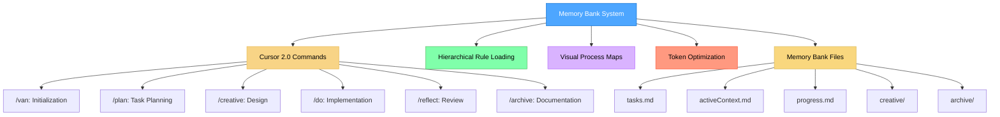

# Memory Bank System v2.3

A token-optimized, hierarchical task management system that works with **Cursor IDE** and **Claude Code** for efficient development workflows with integrated AI Quality Rules, mandatory MCP server integration, Subagents & Skills architecture, and full [Agent Skills](https://agentskills.io) standard compliance.

## 🎯 Dual Platform Support

Memory Bank now supports **two platforms**:

| Platform | Best For | Interface | Documentation |
|----------|----------|-----------|---------------|
| **[Cursor IDE](https://cursor.com)** | Visual development, team collaboration | Graphical IDE with slash commands | This README |
| **[Claude Code](https://claude.ai/code)** | CLI workflows, remote servers, automation | Command-line with `/mb-` commands | [CLAUDE_CODE_SETUP.md](CLAUDE_CODE_SETUP.md) |

**Choose based on your workflow** - or use both! Memory Bank files are fully compatible across platforms.

👉 **New to Memory Bank?**
- **Quick start**: See [QUICK_START.md](QUICK_START.md) for 5-minute setup
- **Detailed comparison**: See [PLATFORM_COMPARISON.md](PLATFORM_COMPARISON.md)



> **Personal Note**: Memory Bank is my personal hobby project that I develop for my own use in coding projects. As this is a personal project, I don't maintain an issues tracker or actively collect feedback. However, if you're using these rules and encounter issues, one of the great advantages is that you can ask the Cursor AI directly to modify or update the rules to better suit your specific workflow. The system is designed to be adaptable by the AI, allowing you to customize it for your own needs without requiring external support.

## About Memory Bank

Memory Bank is a structured development workflow system that uses Cursor 2.0 commands to guide you through different phases of the development process. It uses a hierarchical rule loading architecture that loads only the rules needed for each phase, optimizing token usage and providing tailored guidance.

### How It Works

Version 2.0 builds upon v0.9 with mandatory MCP server integration and PRD generation. Memory Bank operates through **specialized commands** that work together as an integrated workflow:

### Core Workflow Commands

1. **`/prd`** - Generates Product Requirements Documents with **Context Gathering**, **Solution Exploration** (2-3 approaches), and **User Consultation**.
2. **`/van`** - Initializes projects, detects platform, determines task complexity. Now suggests `/prd` for complex tasks.
3. **`/plan`** - Creates detailed implementation plans with **Rollback Strategy**, **Validation Checklist**, and component breakdown.
4. **`/creative`** - Explores design options for components requiring design decisions
5. **`/do`** - Systematically implements planned changes (formerly `/build`)
6. **`/reflect`** - Reviews completed work and documents lessons learned
7. **`/archive`** - Creates comprehensive documentation and updates Memory Bank

### Helper Commands

1. **`/status`** - Checks current task status and workflow progress
2. **`/continue`** - Resumes work on current task from last checkpoint

Each command reads from and updates a shared **Memory Bank** directory (`memory-bank/`), maintaining persistent context across the entire workflow.

### Token-Optimized Architecture

Memory Bank delivers exceptional context efficiency through progressive optimization across multiple versions:

**v2.3** - Agent Skills Standard Compliance:
- **Full [Agent Skills](https://agentskills.io) standard support** with YAML frontmatter
- All 9 commands properly formatted for Claude Code integration
- Clear documentation for project-level vs user-level installation
- Improved troubleshooting with root cause analysis
- Zero breaking changes - backward compatible with v2.1

**v2.1** - Subagents & Skills Architecture:
- **90% context window reduction** via on-demand loading
- CLAUDE.md: Lean router (<1KB, 37 lines)
- Architecture: 4 Agents + 5 Skills + 10 Commands
- 100% coverage of critical Cursor rules
- File count: 72% reduction (75+ → 22 files)

**v2.0** - Claude Code Context Window Optimization:
- **84% total token reduction** across all components
- CLAUDE.md: 78% reduction (480 → 106 lines)
- Commands: 67% reduction (688 → 228 lines)
- Rules: 89% reduction (~3000 → 332 lines)
- Workflows: 80% reduction (216 → 43 lines)

**v0.9** - AI Quality Rules Integration:
- **Hierarchical Rule Loading**: Only loads essential rules initially with specialized lazy-loading (~70% token reduction)
- **3-Tier AI Quality Rules**: Always-loaded principles → Category summaries → Detailed rules (on-demand)
- **Progressive Disclosure**: Rule Reference Cards with expandable details reduce cognitive load

**v0.7** - Original Optimization Framework:
- **Progressive Documentation**: Implements concise templates that scale with task complexity
- **Optimized Command Transitions**: Preserves critical context efficiently between commands
- **Level-Specific Workflows**: Adapts documentation requirements to task complexity (Levels 1-4)
- **Lazy-Loaded Specialized Rules**: Loads specialized rules only when needed (e.g., architecture vs UI/UX design)

See the [Memory Bank Optimizations](MEMORY_BANK_OPTIMIZATIONS.md) document for detailed information about all optimization approaches.

### Command-Based Workflow System

Memory Bank transforms development into a structured, phase-based process:

- **Graph-Based Command Integration**: Commands are interconnected nodes in a development workflow
- **Workflow Progression**: Commands transition from one to another in a logical sequence (`/van` → `/plan` → `/creative` → `/do` → `/reflect` → `/archive`)
- **Shared Memory**: Persistent state maintained across command transitions via Memory Bank files
- **Adaptive Behavior**: Each command adjusts its recommendations based on project complexity level
- **Progressive Rule Loading**: Commands load only necessary rules, reducing context window usage

This approach transforms development from ad-hoc coding into a coordinated system with specialized phases working together.

### CREATIVE Command and Claude's "Think" Tool

The `/creative` command is conceptually based on Anthropic's Claude "Think" tool methodology, as described in their [engineering blog](https://www.anthropic.com/engineering/claude-think-tool). Version 0.9 implements an optimized version with:

- Progressive documentation with tabular option comparison
- "Detail-on-demand" approach that preserves token efficiency
- Structured templates that scale with complexity level
- Efficient context preservation for implementation phases

For a detailed explanation of how Memory Bank implements these principles, see the [CREATIVE Mode and Claude's "Think" Tool](creative_mode_think_tool.md) document.

## Key Features

- **Cursor 2.0 Commands**: Native integration with Cursor's commands feature - no setup required
- **MCP Server Integration**: Mandatory integration with context7 and sys8 MCP servers for accuracy and security
- **AI Quality Rules Integration**: 15 research-proven quality rules embedded in all workflow modes
- **Hierarchical Rule Loading**: Load only the essential rules with specialized lazy-loading (~70% token reduction)
- **Progressive Documentation**: Concise templates that scale with task complexity
- **Unified Context Transfer**: Efficient context preservation between commands via Memory Bank
- **Command-Specific Visual Maps**: Clear visual representations for each development phase
- **Level-Specific Workflows**: Adapted processes based on complexity (Levels 1-4)
- **Platform-Aware Commands**: Automatically adapts commands to your operating system
- **Memory Bank Integration**: All commands read from and update shared Memory Bank files
- **Test-Driven Development**: TDD approach enforced in `/do` command
- **Quality Checkpoints**: Built-in verification at key workflow stages
- **Up-to-Date Documentation**: All library documentation fetched from context7 MCP server
- **Secure System Operations**: All system operations use sys8 MCP server for security and consistency

## Installation Instructions

Memory Bank can be installed for **Cursor IDE**, **Claude Code**, or **both platforms**.

### Choose Your Platform

<details>
<summary><b>📦 Cursor IDE Installation</b> (Click to expand)</summary>

### Prerequisites

- **Cursor Editor**: Version 2.0 or higher is required (commands feature)
- **AI Model**: Claude 4 Sonnet or Claude 4 Opus is recommended for best results, especially for `/creative` command's "Think" tool methodology
- **MCP Servers** (Recommended):
  - **context7 MCP Server**: For up-to-date library documentation and code examples
  - **sys8 MCP Server**: For secure system operations (date/time, OS info, calculations, random strings, hashing)

### Step 1: Get the Files

Simply clone this repository into your project directory:

```bash
git clone git@github.com:Angry-Robot-Deals/cursor-memory-bank-angry.git
```

#### Alternative (Manual)

After extracting it from the ZIP file:

- Copy the `.cursor` folder to your project directory (contains both rules and commands)

**Note**: Other documents are not necessary for Memory Bank operation - they are explanatory documents. You can copy them to a folder like `memory_bank_documents` if desired.

### Step 2: Configure MCP Servers (Recommended)

Memory Bank v2.0 integrates with MCP (Model Context Protocol) servers for enhanced accuracy and security:

#### context7 MCP Server
**Purpose**: Provides up-to-date library documentation and code examples

**Why it's needed**:
- Eliminates reliance on outdated training data
- Prevents API hallucination errors
- Provides version-specific documentation
- Ensures code examples are from official sources

**Installation**:
1. Visit repository: [https://github.com/upstash/context7](https://github.com/upstash/context7)
2. Follow installation instructions in the repository
3. Configure in Cursor's MCP settings (see [MCP Server Configuration](#mcp-server-configuration) below)

#### sys8 MCP Server
**Purpose**: Provides secure system operations

**Why it's needed**:
- Secure date/time operations (no hardcoded timestamps)
- Cross-platform OS information
- Safe mathematical expression evaluation
- Cryptographically secure random strings
- Secure string hashing

**Installation**:
1. Visit repository: [https://github.com/Angry-Robot-Deals/mcp-sys8](https://github.com/Angry-Robot-Deals/mcp-sys8)
2. Follow installation instructions in the repository
3. Configure in Cursor's MCP settings (see [MCP Server Configuration](#mcp-server-configuration) below)

**Note**: Memory Bank will work without MCP servers, but with reduced accuracy and functionality. MCP servers are highly recommended for optimal results.

### Step 3: Using Commands

**Commands are ready to use immediately!** No additional setup required.

1. **Type `/` in the Cursor chat** to see available commands:
   - `/prd` - PRD generation (optional)
   - `/van` - Initialization & entry point
   - `/plan` - Task planning
   - `/creative` - Design decisions
   - `/do` - Code implementation
   - `/reflect` - Task reflection
   - `/archive` - Task archiving

2. **Optional: Start with `/prd`** to generate detailed requirements (recommended for complex tasks):
   ```
   /prd Add notification system for account expiry warnings
   ```

3. **Initialize with `/van`**:
   ```
   /van Initialize project for adding user authentication feature
   ```
   Or reference a PRD:
   ```
   /van Use PRD: memory-bank/prd/PRD-notification-system.md
   ```

4. **Follow the workflow** - each command will guide you to the next step

See [COMMANDS_README.md](COMMANDS_README.md) for detailed command documentation.

</details>

<details>
<summary><b>💻 Claude Code Installation</b> (Click to expand)</summary>

### Prerequisites

- **Claude Code CLI**: Install from [claude.ai/code](https://claude.ai/code)
- **AI Model**: Claude 4 Sonnet or Claude 4 Opus (via Claude API)
- **MCP Servers** (Recommended): Same as Cursor (context7, sys8)

### Step 1: Install Claude Code

Follow official installation instructions at [claude.ai/code](https://claude.ai/code).

Verify installation:
```bash
claude --version
```

### Step 2: Get the Files

Clone this repository or copy files to your project:

```bash
git clone git@github.com:Angry-Robot-Deals/cursor-memory-bank-angry.git
```

Copy to your project:
```bash
# Required: Copy CLAUDE.md (Claude Code configuration)
cp cursor-memory-bank/CLAUDE.md /path/to/your-project/

# Required: Copy .claude directory (commands, workflows, rules)
cp -r cursor-memory-bank/.claude /path/to/your-project/
```

**Note**: Claude Code uses `.claude/` directory (NOT `.cursor/`). The `.cursor/` directory is only for Cursor IDE users.

### Step 3: Configure MCP Servers

Configure MCP servers in Claude Code settings (same as Cursor setup above).

### Step 4: Start Using

Navigate to your project and start Claude Code:
```bash
cd /path/to/your-project
claude
```

Then describe what you want to do:
```
Initialize a new task for adding user authentication
```

Claude Code will automatically follow Memory Bank workflows!

**Full Guide:** See [CLAUDE_CODE_SETUP.md](CLAUDE_CODE_SETUP.md) for detailed usage instructions.

</details>

<details>
<summary><b>🔄 Installing for Both Platforms</b> (Click to expand)</summary>

To use Memory Bank with both Cursor IDE and Claude Code:

1. **Install both tools** (Cursor IDE + Claude Code CLI)
2. **Copy all files** to your project:
   ```bash
   # Copy Cursor IDE configuration
   cp -r cursor-memory-bank/.cursor /path/to/your-project/

   # Copy Claude Code configuration
   cp -r cursor-memory-bank/.claude /path/to/your-project/
   cp cursor-memory-bank/CLAUDE.md /path/to/your-project/
   ```
3. **Configure MCP servers** once (shared configuration)
4. **Use either platform** - Memory Bank files are compatible!

**Note**: Each platform has its own directory:
- Cursor IDE: `.cursor/` (commands in `.md`, rules in `.mdc`)
- Claude Code: `.claude/` (commands and rules in `.md`) + `CLAUDE.md`
- Both share: `memory-bank/` (task files, progress, archives)

**Benefits:**
- ✅ Use Cursor for visual development
- ✅ Use Claude Code for CLI/remote work
- ✅ Share the same `memory-bank/` files
- ✅ Switch platforms seamlessly

</details>

## Basic Usage

### Quick Start

1. **Initialize with `/van`**:
   ```
   /van Add user authentication to the application
   ```
   - Analyzes your project structure
   - Determines task complexity (Level 1-4)
   - Creates Memory Bank structure if needed
   - Routes to appropriate next command

2. **Follow the Workflow Based on Complexity**:

   **Level 1 (Quick Bug Fix):**
   ```
   /van → /do → /reflect → /archive
   ```

   **Level 2 (Simple Enhancement):**
   ```
   /van → /plan → /do → /reflect → /archive
   ```

   **Level 3-4 (Feature/System):**
   ```
   /van → /plan → /creative → /do → /reflect → /archive
   ```

### Command Reference

#### `/prd` - Product Requirements Document Generator (OPTIONAL)
**Purpose:** Transform brief task descriptions into structured PRD documents BEFORE starting implementation.

**Usage:**
```
/prd Add notification system for account expiry warnings
```

**What it does:**
- Analyzes brief task description
- **Context Gathering**: Scans codebase and identifies constraints
- **Solution Exploration**: Proposes 2-3 technical approaches with pros/cons
- Creates structured PRD with problem statement, scope, technical considerations
- Estimates complexity level
- Saves to `memory-bank/prd/PRD-{TASK_NUMBER}-{description}.md`

**Next steps:**
- Review generated PRD document
- Use `/van` with PRD reference to initialize task

#### `/van` - Initialization & Entry Point
**Purpose:** Initialize Memory Bank, detect platform, determine task complexity, route to workflows.

**Usage:**
```
/van [task description]
```

**What it does:**
- Detects your operating system and adapts commands
- Verifies or creates Memory Bank structure
- Analyzes task requirements
- Determines complexity level (1-4)
- Updates `memory-bank/tasks.md` with initial task information

**Next steps:**
- Level 1 → `/do`
- Level 2-4 → `/plan`

#### `/plan` - Task Planning
**Purpose:** Create detailed implementation plans based on complexity level.

**Usage:**
```
/plan
```

**What it does:**
- Reads task requirements from `memory-bank/tasks.md`
- Reviews codebase structure
- Creates implementation plan (complexity-appropriate)
- **Detailed Design**: Includes Rollback Plan and Validation Checklist
- Identifies components requiring creative phases
- Updates `memory-bank/tasks.md` with complete plan

**Next steps:**
- Creative phases identified → `/creative`
- No creative phases → `/do`

#### `/creative` - Design Decisions
**Purpose:** Perform structured design exploration for flagged components.

**Usage:**
```
/creative
```

**What it does:**
- Reads components flagged for creative work from `memory-bank/tasks.md`
- For each component, explores multiple design options
- Analyzes pros/cons of each approach
- Selects and documents recommended approach
- Creates `memory-bank/creative/creative-[feature_name].md` documents
- Updates `memory-bank/tasks.md` with design decisions

**Next steps:**
- After all creative phases complete → `/do`

#### `/do` - Code Implementation
**Purpose:** Implement planned changes following the plan and creative decisions.

**Usage:**
```
/do
```

**What it does:**
- Reads implementation plan from `memory-bank/tasks.md`
- Reads creative phase documents (Level 3-4)
- Implements changes systematically following AI Quality Rules
- Applies test-driven development (TDD) approach
- Tests implementation
- Documents commands executed and results
- Updates `memory-bank/tasks.md` and `memory-bank/progress.md`

**Next steps:**
- After implementation complete → `/reflect`

#### `/reflect` - Task Reflection
**Purpose:** Facilitate structured reflection on completed implementation.

**Usage:**
```
/reflect
```

**What it does:**
- Reviews completed implementation
- Compares against original plan
- Documents what went well
- Documents challenges encountered
- Documents lessons learned
- Documents process and technical improvements
- Creates `memory-bank/reflection/reflection-[task_id].md`
- Updates `memory-bank/tasks.md` with reflection status

**Next steps:**
- After reflection complete → `/archive`

#### `/archive` - Task Archiving
**Purpose:** Create comprehensive archive documentation and update Memory Bank.

**Usage:**
```
/archive
```

**What it does:**
- Reads reflection document and task details
- Creates comprehensive archive document
- Archives creative phase documents (Level 3-4)
- Updates `memory-bank/tasks.md` marking task COMPLETE
- Updates `memory-bank/progress.md` with archive reference
- Resets `memory-bank/activeContext.md` for next task
- Creates `memory-bank/archive/archive-[task_id].md`

**Next steps:**
- After archiving complete → `/van` (for next task)

### Example Workflow

Here's a complete example workflow for a Level 3 feature:

**Option 1: Direct Start (clear requirements)**
```bash
# Step 1: Initialize
/van Add user authentication with OAuth2 support

# Step 2: Plan (VAN routes to PLAN for Level 3)
/plan

# Step 3: Explore design options for OAuth integration
/creative

# Step 4: Implement the feature
/do

# Step 5: Reflect on the implementation
/reflect

# Step 6: Archive the completed task
/archive
```

**Option 2: With PRD (recommended for complex features)**
```bash
# Step 0: Generate PRD first
/prd Implement user role-based access control for the dashboard

# Step 1: Review PRD, then initialize with PRD reference
/van Use PRD: memory-bank/prd/PRD-role-based-access.md

# Step 2: Plan (VAN routes to PLAN for Level 3)
/plan

# Step 3: Explore design options
/creative

# Step 4: Implement the feature
/do

# Step 5: Reflect on the implementation
/reflect

# Step 6: Archive the completed task
/archive
```

## Memory Bank Structure

All Memory Bank files are stored in the `memory-bank/` directory:

```mermaid
graph LR
    subgraph "Memory Bank Directory"
        Tasks["tasks.md<br>Active Task"]
        Backlog["backlog.md<br>Active Queue"]
        BacklogArch["backlog-archive.md<br>Historical Items"]
        Active["activeContext.md<br>Current Focus"]
        Progress["progress.md<br>Implementation Status"]
        Brief["projectbrief.md<br>Project Foundation"]
        Creative["creative/<br>Design Decisions"]
        Reflect["reflection/<br>Review Documents"]
        Archive["archive/<br>Completed Tasks"]
    end
    
    style Tasks fill:#f9d77e,stroke:#d9b95c,stroke-width:3px,color:black
    style Backlog fill:#ff9980,stroke:#ff5533,stroke-width:2px,color:black
    style Active fill:#a8d5ff,stroke:#88b5e0,color:black
    style Progress fill:#c5e8b7,stroke:#a5c897,color:black
    style Brief fill:#d9b3ff,stroke:#b366ff,color:black
    style Creative fill:#f4b8c4,stroke:#d498a4,color:black
    style Reflect fill:#b3e6cc,stroke:#66c999,color:black
    style Archive fill:#ffd9b3,stroke:#ffb366,color:black
```



### Core Files

- **`tasks.md`**: Central source of truth for active task tracking, checklists, and component lists
- **`backlog.md`**: Active task queue for future work (v2.0 - Performance Optimized)
  - Contains only `pending` and `in_progress` tasks
  - Tasks can be added by `/prd` and `/van` commands
  - Tasks can be selected and activated by `/van` command
  - Format: `BACKLOG-XXXX` items with priority and complexity
  - 10-20x faster reads (only active items, completed moved to archive)
- **`backlog-archive.md`**: Historical Backlog archive (NEW in v2.1)
  - Contains `completed` and `cancelled` Backlog items
  - Keeps active backlog small and fast
  - Provides historical reference when needed
  - Automatically updated by `/archive` command
- **`activeContext.md`**: Maintains focus of current development phase
- **`progress.md`**: Tracks implementation status and observations
- **`projectbrief.md`**: Project foundation and context
- **`productContext.md`**: Product-specific context and requirements
- **`systemPatterns.md`**: System patterns and architectural decisions
- **`techContext.md`**: Technical context and technology stack
- **`prd/`**: Product Requirements Documents (PRD-XXX-*.md)

### Generated Files

- **`prd/PRD-[task_id]-[description].md`**: Product Requirements Documents (optional, pre-workflow)
- **`creative/creative-[feature_name].md`**: Design decision documents (Level 3-4)
- **`reflection/reflection-[task_id].md`**: Reflection documents
- **`archive/archive-[task_id].md`**: Archive documents for completed tasks

### Backlog System (v2.0 - Performance Optimized)

**NEW in v2.1**: The Backlog system provides a powerful task queue with 10-20x performance improvement through two-file architecture.

**Key Features:**
- **Two-File Architecture**: Active backlog (`backlog.md`) + historical archive (`backlog-archive.md`)
- **Performance Optimized**: 10-20x faster reads by keeping active backlog small
- **Dual-Platform Support**: Works seamlessly with both Cursor IDE and Claude Code
- **Task ID Format**: `BACKLOG-XXXX` (e.g., `BACKLOG-0001`, `BACKLOG-0042`)
- **Full Integration**: Integrated with `/prd`, `/van`, and `/status` commands

**Workflow:**

1. **Adding to Backlog**:
   - `/prd` can identify and add follow-up tasks automatically
   - `/van` can add new tasks for later work
   - Manual addition to `backlog.md`

2. **Working from Backlog**:
   - `/van` shows pending Backlog items on startup
   - Select by ID: `/van BACKLOG-0001`
   - Or choose from displayed list

3. **Backlog Item Format**:
   ```markdown
   ### BACKLOG-0001: Task Title
   - Status: pending | in_progress
   - Priority: critical | high | medium | low
   - Complexity: Level 1-4
   - Description: Brief but comprehensive description
   ```

4. **Archival**:
   - Completed/cancelled items automatically moved to `backlog-archive.md`
   - Keeps active backlog clean and fast
   - Historical record preserved in archive

## Progressive Rule Loading

Each command implements progressive rule loading to optimize context usage:

1. **Core Rules** - Always loaded first
   - `main.mdc` - System foundation
   - `memory-bank-paths.mdc` - File path definitions
   - `Core/AI-Quality/_principles.mdc` - AI Quality core principles (v0.9+)

2. **Command-Specific Rules** - Loaded based on command
   - Visual process maps (e.g., `van-mode-map.mdc`)
   - Command-specific workflows
   - AI Quality Rule Reference Cards (v0.9+)

3. **Complexity-Specific Rules** - Loaded based on task complexity
   - Level 1: `workflow-level1.mdc`
   - Level 2: `workflow-level2.mdc`, `task-tracking-basic.mdc`
   - Level 3: `workflow-level3.mdc`, `planning-comprehensive.mdc`
   - Level 4: `workflow-level4.mdc`, `architectural-planning.mdc`

4. **Specialized Rules** - Lazy loaded only when needed
   - Creative phase types (architecture, UI/UX, algorithm)
   - Advanced verification rules
   - Platform-specific adaptations
   - Detailed AI Quality Rules (v0.9+)

This approach reduces initial token usage by **~70%** compared to loading all rules at once.

### AI Quality Rules (v0.9+)

Version 0.9 introduces 15 research-proven AI Quality Rules organized in a 3-tier hierarchy:

- **Tier 1 (Always Loaded)**: Core principles and navigation (~2-3K tokens)
- **Tier 2 (Mode-Based)**: Category summaries loaded per mode (~500-800 tokens each)
- **Tier 3 (On-Demand)**: Detailed rule files loaded when needed (~1-2K tokens each)

Each workflow mode includes Rule Reference Cards with:
- Quick one-liner guidance
- Expandable detailed sections
- Quality checkpoints
- Links to full rule documentation

See `Core/AI-Quality/QUICK_REFERENCE.md` for a complete guide to all 15 rules.

## Complexity Levels

Memory Bank adapts its workflow based on task complexity:

### Level 1: Quick Bug Fix
- **Workflow**: `/van` → `/do` → `/reflect` → `/archive`
- **Characteristics**: Single file changes, targeted fixes
- **Documentation**: Minimal, focused on the fix

### Level 2: Simple Enhancement
- **Workflow**: `/van` → `/plan` → `/do` → `/reflect` → `/archive`
- **Characteristics**: Multiple files, clear requirements
- **Documentation**: Basic plan, implementation steps

### Level 3: Intermediate Feature
- **Workflow**: `/van` → `/plan` → `/creative` → `/do` → `/reflect` → `/archive`
- **Characteristics**: New components, design decisions needed
- **Documentation**: Comprehensive plan, creative phases, detailed reflection

### Level 4: Complex System
- **Workflow**: `/van` → `/plan` → `/creative` → `/do` → `/reflect` → `/archive`
- **Characteristics**: Multiple subsystems, architectural decisions
- **Documentation**: Phased implementation, architectural diagrams, comprehensive archive

## Troubleshooting

### Commands Not Appearing

- **Verify Cursor version**: Ensure you're using Cursor 2.0 or higher
- **Check file location**: Ensure `.cursor/commands/` directory exists in project root
- **Restart Cursor**: Sometimes a restart is needed to detect new commands

### Command Not Working Correctly

- **Check Memory Bank**: Verify `memory-bank/` directory exists
- **Verify task status**: Check `memory-bank/tasks.md` for current task state
- **Review command order**: Ensure you're following the correct workflow sequence
- **Check rules**: Verify `.cursor/rules/isolation_rules/` directory exists

### Rules Not Loading

- **Verify file paths**: Ensure rule files are in `.cursor/rules/isolation_rules/`
- **Check file permissions**: Verify files are readable
- **Review command logs**: Check what rules the command is trying to load

### Memory Bank Issues

- **Missing files**: Run `/van` to initialize Memory Bank structure
- **Corrupted state**: Check `memory-bank/tasks.md` for task status
- **File conflicts**: Review recent changes to Memory Bank files

## MCP Server Configuration

### Required MCP Servers

Memory Bank v2.0 uses two MCP servers:

#### 1. context7 MCP Server
- **Repository**: [https://github.com/upstash/context7](https://github.com/upstash/context7)
- **Purpose**: Provides up-to-date library documentation and code examples
- **Features**: Version-specific APIs, no hallucinations, real documentation

#### 2. sys8 MCP Server
- **Repository**: [https://github.com/Angry-Robot-Deals/mcp-sys8](https://github.com/Angry-Robot-Deals/mcp-sys8)
- **Purpose**: Secure system operations (date/time, OS info, calculations, hashing)
- **Features**: Cross-platform compatibility, cryptographically secure operations

### Configuration

MCP servers are configured in Cursor's MCP settings. The configuration file is typically located at:
- `.cursor/mcp.json` (project-specific)
- Global MCP configuration (Cursor settings)

#### Example Configuration

```json
{
  "mcpServers": {
    "context7": {
      "command": "npx",
      "args": ["-y", "@context7/mcp-server"]
    },
     "sys8": {
        "command": "npx",
        "args": [
           "tsx",
           "$HOME/code/AI/mcp/sys8/src/index.ts"
        ]
     }
  }
}
```

**Note**: Actual installation commands and configuration may vary. Check the specific MCP server documentation for exact setup instructions.

### MCP Server Benefits

#### context7 MCP Server
- **Up-to-date APIs**: Always get the latest library documentation
- **Version-specific**: Support for exact library versions
- **No Hallucinations**: Real APIs, not invented ones
- **Code Examples**: Working examples from official sources

#### sys8 MCP Server
- **Security**: Cryptographically secure operations
- **Consistency**: Unified interface for system operations
- **Cross-platform**: Handles platform differences automatically
- **Error Prevention**: Built-in validation and error handling

## Version Information

This is version v2.3 of the Memory Bank system. It introduces full [Agent Skills](https://agentskills.io) standard compliance for Claude Code, ensuring all commands work correctly with proper YAML frontmatter and clear installation documentation for both project-level and user-level usage. Previous versions introduced the Subagents & Skills architecture (v2.1), MCP server integration (v2.0), hierarchical rule loading (v0.9), and progressive documentation (v0.7). See the [Release Notes](RELEASE_NOTES.md) for detailed information about all changes.

### Ongoing Development

The Memory Bank system is actively being developed and improved. Key points to understand:

- **Work in Progress**: This is a beta version with ongoing development. Expect regular updates, optimizations, and new features.
- **Feature Optimization**: The modular architecture enables continuous refinement without breaking existing functionality.
- **Previous Version Available**: If you prefer the stability of the previous version (v0.1-legacy), you can continue using it while this version matures.
- **Architectural Benefits**: Before deciding which version to use, please read the [Memory Bank Upgrade Guide](memory_bank_upgrade_guide.md) to understand the significant benefits of the new architecture.

## Platform Documentation

### Quick Start
- [PROJECT_STRUCTURE.md](PROJECT_STRUCTURE.md) - **Project directory structure explained**
- [PLATFORM_COMPARISON.md](PLATFORM_COMPARISON.md) - **Compare Cursor IDE vs Claude Code**

### For Both Platforms
- [MEMORY_BANK_OPTIMIZATIONS.md](MEMORY_BANK_OPTIMIZATIONS.md) - Token efficiency improvements
- [RELEASE_NOTES.md](RELEASE_NOTES.md) - Version history and changes

### For Cursor IDE Users
- [COMMANDS_README.md](COMMANDS_README.md) - Detailed command usage guide

### For Claude Code Users
- [CLAUDE_CODE_SETUP.md](CLAUDE_CODE_SETUP.md) - **Complete Claude Code setup and usage guide**
- [CLAUDE.md](CLAUDE.md) - Claude Code configuration file

### Additional Resources
- [documentation/historical/](documentation/historical/) - System evolution and design decisions (optional reading)

## Contributing

As mentioned in the personal note above, Memory Bank is a personal project. However, if you find it useful and want to adapt it for your own needs, you can:

1. **Ask Cursor AI**: Modify the rules and commands directly using Cursor AI
2. **Fork and Customize**: Clone the repository and adapt it to your workflow
3. **Share Improvements**: If you make useful improvements, consider sharing them with the community

---

*Note: This README is for v2.3 and subject to change as the system evolves.*
