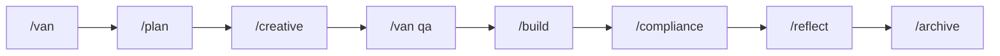

# Cursor Commands Reference (documentation)

This document is **project documentation only**. It is not loaded as a rule.  
Command behavior is defined in `.cursor/rules/cursor-commands/*.mdc` and `.cursor/rules/isolation_rules/visual-maps/`.

---

## Command categories

### 1. Task lifecycle

| Command       | Purpose                                      | When to use              |
|---------------|-----------------------------------------------|--------------------------|
| `/van`        | Initialize/analyze task                      | Start of any task        |
| `/plan`       | Detailed planning                            | Level 2–4 tasks         |
| `/creative`   | Design decisions                             | Level 3–4 tasks         |
| `/build`      | Implementation                               | After planning/creative |
| `/compliance` | Post-QA hardening & PRD revalidation         | After implementation    |
| `/reflect`    | Task review                                   | After implementation    |
| `/archive`    | Task documentation                           | After reflection        |

### 2. QA

| Command   | Purpose               | When to use           |
|-----------|-----------------------|------------------------|
| `/qa`     | Technical validation  | Before implementation |
| `/van qa` | QA validation         | After creative        |

### 3. Archive variants

| Command              | Purpose                          |
|----------------------|-----------------------------------|
| `/archive`           | Archive current task             |
| `/archive TASK-ID`   | Archive specific task             |
| `/archive --list`   | List archivable tasks            |
| `/archive --all`    | Archive all (with confirmation)  |

## Task lifecycle workflow

## Command details (references)

- **/van**: `.cursor/rules/isolation_rules/visual-maps/van_mode_split/van-mode-map.mdc`
- **/plan**: `.cursor/rules/isolation_rules/visual-maps/plan-mode-map.mdc`
- **/creative**: `.cursor/rules/isolation_rules/visual-maps/creative-mode-map.mdc`
- **/build**: `.cursor/rules/isolation_rules/visual-maps/build-mode-map.mdc`
- **/compliance**: `.cursor/rules/cursor-commands/compliance-command.mdc`
- **/reflect**: `.cursor/rules/isolation_rules/visual-maps/reflect-mode-map.mdc`
- **/archive**: `.cursor/rules/cursor-commands/archive-command.mdc`, task-context-tracking.mdc, archive-mode-map.mdc
- **/qa, /van qa**: `.cursor/rules/isolation_rules/visual-maps/van_mode_split/van-qa-main.mdc`

## Task context and MCP

- **Task context**: `activeContext.md` identifies current task; `/archive` archives only that task. See `task-context-tracking.mdc`.
- **sys8 MCP**: Date/time and OS — `.cursor/rules/sys8-mcp-usage.mdc`
- **context7 MCP**: Library docs — `.cursor/rules/context7-mcp-usage.mdc`

## Other resources

- Core: `isolation_rules/main.mdc`, `memory-bank-paths.mdc`, `task-context-tracking.mdc`, `platform-awareness.mdc`
- Visual maps: `van-mode-map.mdc`, `plan-mode-map.mdc`, `creative-mode-map.mdc`, `build-mode-map.mdc`, `reflect-mode-map.mdc`, `archive-mode-map.mdc`
- Level workflows: `Level1/`, `Level2/`, `Level3/`, `Level4/`

---

*Moved from `.cursor/rules/cursor-commands/README.mdc` so agent folders are not used for long documentation.*
