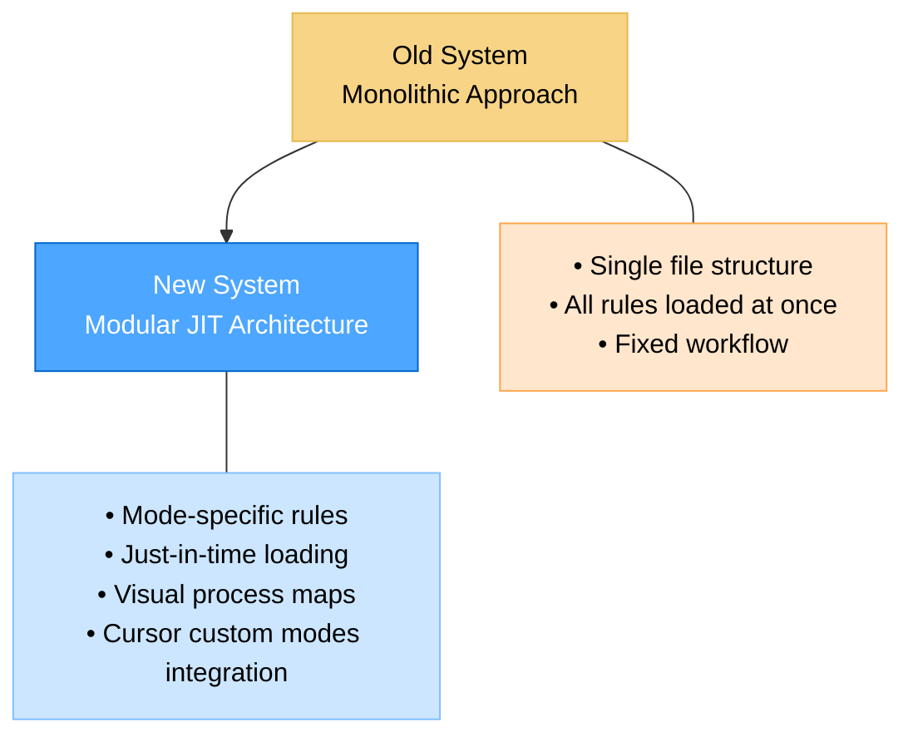
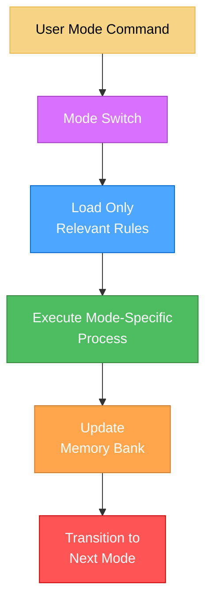
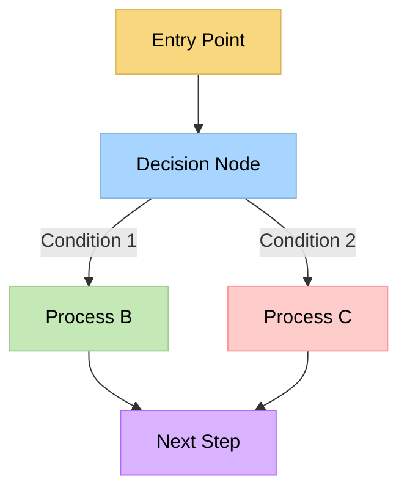
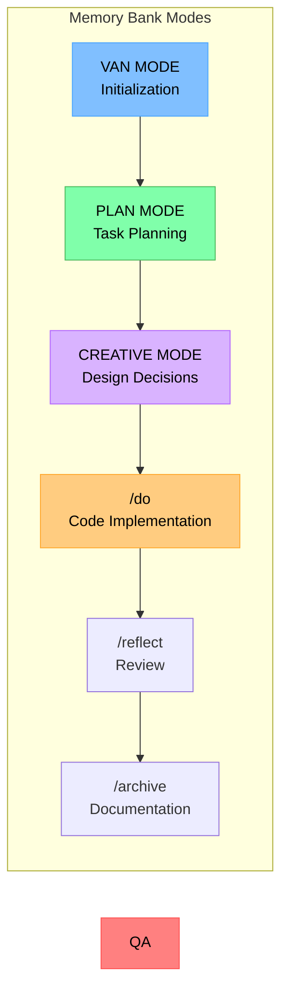
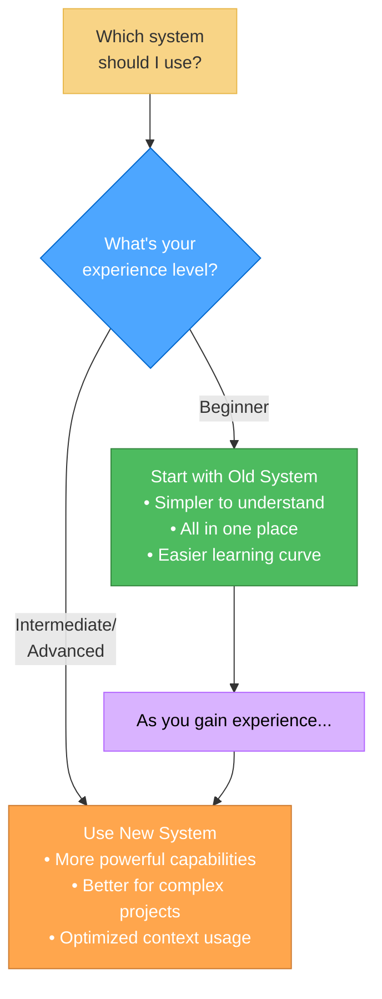
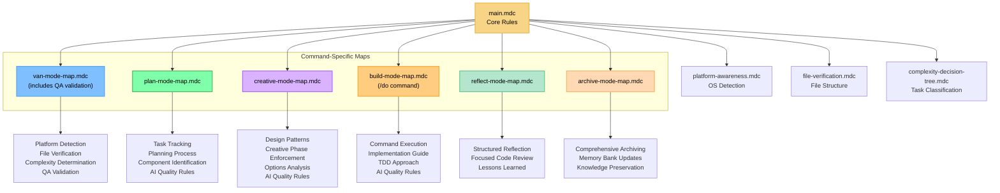
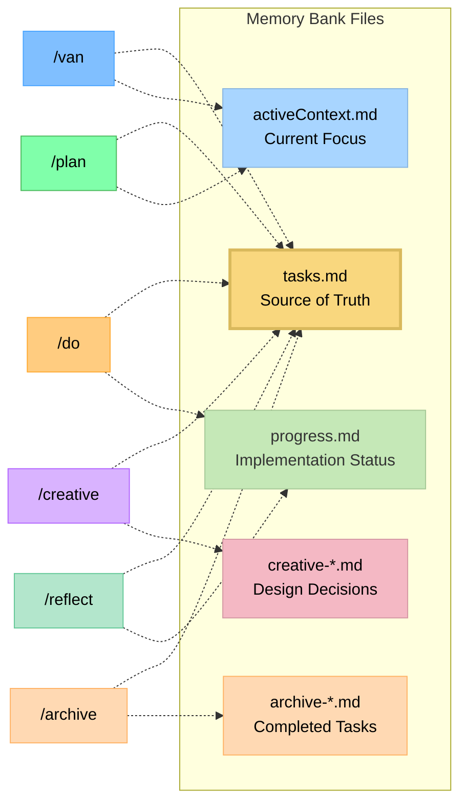
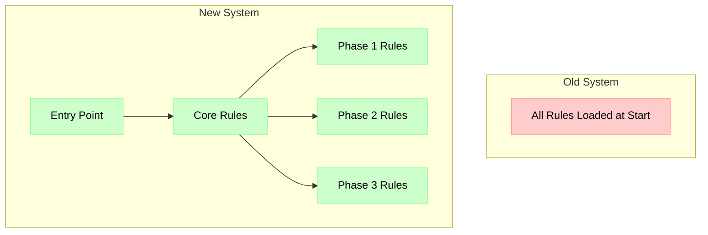
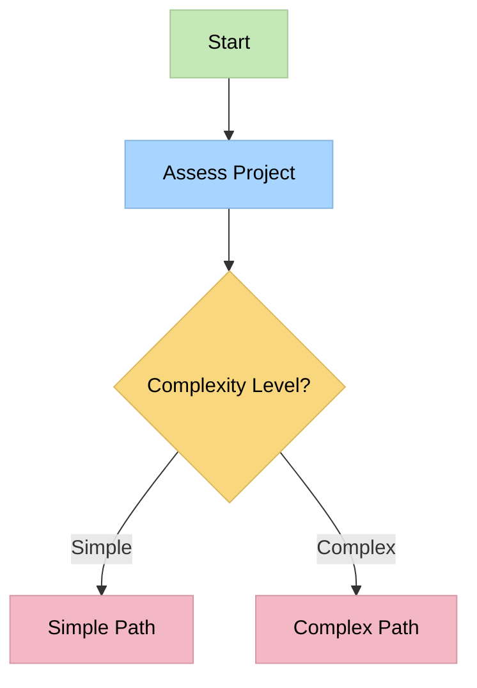

# Memory Bank System Upgrade: From Monolithic to Modular

## Introduction

I'm excited to introduce a significant upgrade to the Memory Bank system – evolving from a monolithic all-in-one approach to a modular, graph-based system that integrates with Cursor's custom modes. This document explains the reasons behind this transition, its benefits, and how to get the most out of the new system.



## Why I'm Upgrading

The old Memory Bank system served well, providing a structured approach to task management with its adaptive complexity levels and comprehensive documentation. However, as projects grew in complexity, I identified several limitations:

1. **Context Inefficiency**: Loading all rules at once regardless of relevance
2. **Limited Visual Guidance**: Text-heavy instructions without visual process maps
3. **Token Waste**: Consuming context window with irrelevant rules
4. **One-Size-Fits-All Approach**: Less tailored to specific development phases
5. **Scalability Challenges**: Difficulty in maintaining a growing single-file system

While the new system offers significant advantages in efficiency and scalability, I acknowledge it does introduce a steeper learning curve. This trade-off is intentional – the increased initial complexity enables more powerful capabilities, better organization, and improved long-term development outcomes for complex projects.

## The New Isolation-Focused Architecture

The new system addresses these limitations through a modular, Just-In-Time (JIT) architecture that loads only the rules you need when you need them.



Importantly, the new system preserves the foundational 4-level complexity scale from the original system. This scale (Level 1: Quick Bug Fix, Level 2: Simple Enhancement, Level 3: Intermediate Feature, Level 4: Complex System) remains central to determining workflow paths and documentation requirements, ensuring continuity for users familiar with the original approach.

### Key Features of the New System

1. **Mode-Specific Visual Maps**: Clear visual representations for each development phase
2. **Just-In-Time Rule Loading**: Load only the rules needed for your current task
3. **Visual Decision Trees**: Guided workflows with clear checkpoints
4. **Technical Validation**: QA validation integrated in `/van` command (VAN QA mode)
5. **Platform-Aware Commands**: Automatically adapts commands to your operating system

### Graph-Based Efficiency

A fundamental enabler of the new system's capabilities is its graph-based architecture:

- **Optimized Path Navigation**: The system uses directed graphs to navigate complex decision trees with minimal overhead
- **Contextual Relationships**: Graph structures explicitly model relationships between development phases and components, enabling smarter transitions
- **Resource Optimization**: Each node in the graph loads only the resources needed for that specific step
- **Parallel Processing Potential**: The graph structure makes it easier to identify components that can be addressed in parallel



**Before**: Linear execution paths with redundant rule evaluations.

**After**: Optimized traversal through decision points with clear conditionals and merge points.

This graph-based approach is particularly effective when working with large, complex projects where different components have varied requirements and dependencies. The system can efficiently navigate these complexities without overwhelming the context window.

### CREATIVE Mode and Claude's "Think" Tool

One notable aspect of the new system is that the CREATIVE mode is conceptually based on Anthropic's Claude "Think" tool methodology, as described in their [engineering blog](https://www.anthropic.com/engineering/claude-think-tool). This approach has been enhanced and integrated into the Memory Bank workflow:

- **Structured Exploration**: The CREATIVE mode guides users through systematic exploration of design options
- **Explicit Reasoning**: Requires documentation of pros and cons for different approaches
- **Component Breakdown**: Helps break complex problems into manageable components
- **Decision Documentation**: Creates formal records of design decisions with clear rationales
- **Continuous Refinement**: The implementation will continue to evolve as Claude's capabilities advance

This methodology has proven particularly effective for complex design decisions, ensuring that all options are thoroughly considered before implementation begins.

## Integration with Cursor 2.0 Commands

The new system takes full advantage of Cursor 2.0's commands feature, which allows for specialized AI behaviors for different tasks.

> **Note (v0.9)**: The system has migrated from custom modes to Cursor 2.0 commands. Commands provide better integration and easier discovery.

### What Are Cursor 2.0 Commands?

Cursor 2.0 commands allow you to trigger specialized workflows with `/` prefix. The Memory Bank system creates specialized commands for each development phase:



Each mode loads only its required rule set, optimizing context usage and providing specialized guidance:

| Mode | Purpose | Key Features |
|------|---------|-------------|
| VAN | Initialization | Platform detection, file verification, complexity determination |
| PLAN | Task Planning | Requirements analysis, component identification, implementation strategy |
| CREATIVE | Design Decisions | Multiple options exploration, pros/cons analysis, design recommendations |
| /do | Code Implementation | Systematic building, TDD approach, AI Quality Rules, command execution, testing |
| /reflect | Review | Structured reflection, focused code review, lessons learned documentation |
| /archive | Documentation | Comprehensive archiving, Memory Bank updates, knowledge preservation |

### Beyond Cursor's Standard Commands Implementation

While Cursor 2.0's commands feature provides basic command functionality, Memory Bank significantly extends this concept with integrated workflows and AI Quality Rules:

#### Standard Cursor Commands Approach

According to Cursor's documentation, commands typically consist of:
- Command definition in `.cursor/commands/` directory
- Basic instructions for the command
- Tool selection for the command

Standard commands function as isolated tools without inherent connections between them.

#### Memory Bank's Enhanced Commands Approach

```mermaid
graph TD
    subgraph "Cursor's Standard Approach"
        M1["Mode 1<br>Static Instructions"]
        M2["Mode 2<br>Static Instructions"]
        M3["Mode 3<br>Static Instructions"]
    end
    
    subgraph "Memory Bank's Approach"
        MB1["/van Command<br>Dynamic Rules + AI Quality"]
        MB2["/plan Command<br>Dynamic Rules + AI Quality"]
        MB3["/creative Command<br>Dynamic Rules + AI Quality"]
        MB4["/do Command<br>Dynamic Rules + AI Quality"]
        MB5["/reflect Command<br>Dynamic Rules + AI Quality"]
        MB6["/archive Command<br>Dynamic Rules + AI Quality"]
        
        MB1 -->|"Passes Context"| MB2
        MB2 -->|"Passes Context"| MB3
        MB3 -->|"Passes Context"| MB4
        MB4 -->|"Passes Context"| MB5
        MB5 -->|"Passes Context"| MB6
        
        MemBank["Memory Bank Files<br>(Shared State)"]
        MB1 <-->|"Read/Write"| MemBank
        MB2 <-->|"Read/Write"| MemBank
        MB3 <-->|"Read/Write"| MemBank
        MB4 <-->|"Read/Write"| MemBank
        MB5 <-->|"Read/Write"| MemBank
    end
    
    style M1 fill:#f8d486,stroke:#e8b84d,color:black
    style M2 fill:#f8d486,stroke:#e8b84d,color:black
    style M3 fill:#f8d486,stroke:#e8b84d,color:black
    
    style MB1 fill:#80bfff,stroke:#4da6ff,color:black
    style MB2 fill:#80ffaa,stroke:#4dbb5f,color:black
    style MB3 fill:#d9b3ff,stroke:#b366ff,color:black
    style MB4 fill:#ffcc80,stroke:#ffaa33,color:black
    style MB5 fill:#b3e6cc,stroke:#66c999,color:black
    style MB6 fill:#ffd9b3,stroke:#ffb366,color:black
    style MemBank fill:#f9d77e,stroke:#d9b95c,stroke-width:3px,color:black
```



Memory Bank transforms commands into a comprehensive, interconnected system with integrated AI Quality Rules:

1. **Graph-Based Architecture**: 
   - Commands represent nodes in a development workflow with explicit transitions
   - Each command understands its place in the overall development process
   - Visual process maps guide users through the appropriate sequence

2. **Workflow Integration**: 
   - Commands form a cohesive development process (VAN → PLAN → CREATIVE → DO → REFLECT → ARCHIVE)
   - Each command is aware of preceding and subsequent commands
   - Transitions between commands are formalized with specific entry/exit criteria

3. **Shared Memory**: 
   - Persistent state maintained across command transitions via Memory Bank files
   - Tasks.md serves as the central source of truth across all commands
   - Each command contributes specific types of information to the shared knowledge base

4. **Just-In-Time Rule Loading**: 
   - Each command dynamically loads only its specific rule set
   - Rules are specialized for the current development phase
   - Context window is preserved for productive work
   - Rules can adapt based on project complexity level
   - **v0.9**: AI Quality Rules integrated with 3-tier hierarchical loading

5. **Visual Process Maps**: 
   - Each command contains embedded Mermaid diagrams
   - Visual guidance for decision points and workflow options
   - Clear checkpoints to track progress within each phase
   - **v0.9**: Rule Reference Cards with progressive disclosure

6. **Complexity-Adaptive Behavior**: 
   - Commands adjust their behavior based on the complexity level determined during initialization
   - Simpler projects follow streamlined processes
   - Complex projects receive more comprehensive guidance

7. **AI Quality Rules Integration (v0.9)**: 
   - 15 research-proven quality rules embedded in all commands
   - Mode-specific rule guidance with Rule Reference Cards
   - Quality checkpoints at key workflow stages
   - Evidence-based practices automatically applied

### Benefits of This Approach

This enhanced approach to commands offers several advantages:

1. **Improved Context Utilization**: By loading only relevant rules, more context is available for actual development work (~70% token reduction)
2. **Coherent Development Process**: Commands work together as a unified system rather than disconnected tools
3. **Phase-Appropriate Guidance**: Each development phase receives specialized guidance optimized for its needs
4. **Knowledge Persistence**: Important information is preserved across command transitions
5. **Reduced Cognitive Overhead**: Developers can focus on the current phase without being distracted by irrelevant guidance
6. **Evidence-Based Quality (v0.9)**: AI Quality Rules automatically guide development practices, improving code quality by 30-50% and reducing bugs by 40-50%

### Potential Future Enhancements

If this approach proves successful through testing, it could potentially inspire several enhancements to how commands are used:

1. **Formalized Command Transitions**: More explicit handoffs between development phases
2. **Enhanced Visual Guidance**: More sophisticated process maps and decision trees
3. **Deeper Integration with Memory Bank**: More specialized document types for different development phases
4. **Custom Command Templates**: Pre-configured command sequences for different project types
5. **Team Collaboration**: Coordinated use of commands across multiple team members
6. **Level-Specific Rule Adaptations (v0.9+)**: Lightweight Level 1 versions, comprehensive Level 4 versions

While this implementation introduces more complexity in setup compared to standard commands, it offers significantly more powerful capabilities for structured development processes. The system transforms commands from isolated AI behaviors into components of a comprehensive development methodology with integrated quality practices.

## Real-World Benefits: Evidence from Projects

My testing with real-world projects (including a complex Todo application) demonstrated significant benefits from the new system:

1. **Enforced Development Discipline**: Mode switching created natural phase separations, reducing the tendency to jump directly to implementation
2. **Comprehensive Documentation**: Each mode produced specialized documentation with explicit design decisions
3. **Systematic Development**: Components were built according to plan in logical dependency order
4. **Flexibility When Needed**: Hybrid approaches (like QA validation in VAN mode) worked effectively without losing structure

From the analysis document:

> "I observed tangible differences in development approach between modes. Each mode successfully optimized for its specific phase of development. The quality of the final application benefited from this structured approach."

## Comparison: Old vs. New System

| Aspect | Old System | New System |
|--------|------------|------------|
| **Structure** | Single file | Multiple specialized files |
| **Context Usage** | Loads everything at once | Just-in-time loading |
| **Guidance** | Text-based instructions | Visual process maps + text |
| **Decision Making** | Basic decision points | Comprehensive decision trees |
| **Technical Validation** | Basic verification | QA validation integrated in VAN mode |
| **Platform Awareness** | Limited | Comprehensive adaptation |
| **Memory Bank** | Same core files | Same core files with improved organization |
| **Documentation** | Standardized formats | Mode-specific specialized formats |
| **Complexity Levels** | 4-level scale | Same 4-level scale with enhanced process flows |

## When to Use Each System



### Guidelines for Trying the New System

- **New Projects**: The new system works best when starting fresh projects rather than converting existing ones
- **Testing Approach**: If you want to try it with an existing project, make a backup first and experiment in a safe environment
- **No Formal Migration Path**: I haven't developed a formal migration path from old to new systems - it's currently designed for new implementations
- **Learning Projects**: Use the old system for simpler projects if you're still getting comfortable with the Memory Bank concept
- **Complex Projects**: The new system shines with multi-component projects requiring careful planning

## Getting Started with the New System

### Basic Commands

To activate different modes in the new system:

```
VAN - Initialize project and determine complexity
PLAN - Create detailed implementation plan
CREATIVE - Explore design options for complex components
DO - Systematically build planned components (with AI Quality Rules)
REFLECT - Review completed work and document lessons learned
ARCHIVE - Create comprehensive documentation and update Memory Bank
```

### Example Workflow

1. Begin with `VAN` to initialize the project and determine complexity
2. For Level 2-4 tasks, transition to `PLAN` to create a comprehensive implementation plan
3. For components requiring design decisions, use `CREATIVE` to explore options
4. Implement the planned changes with `DO` (applies AI Quality Rules automatically)
5. Review completed work with `REFLECT` to document lessons learned
6. Archive the completed task with `ARCHIVE` for future reference

The complexity level (1-4) determined during the VAN mode will significantly influence your path through the workflow:
- **Level 1 tasks** may proceed directly to DO after VAN
- **Level 2-4 tasks** follow the full workflow with increasingly comprehensive planning and documentation

## Deep Dive: The Technical Architecture

For those interested in the technical details, the new system uses a graph-based approach with isolated rule files loaded just-in-time:



### Memory Bank Continuity

While the rules are modularized, the Memory Bank files maintain continuity across commands:



## Practical Example: Todo App Development

Here's how I used the new system to develop a complex Todo application:

1. **VAN Mode**: Analyzed requirements, set up project structure, determined Level 3 complexity
2. **PLAN Mode**: Created comprehensive component hierarchy, identified dependencies, flagged components for creative exploration
3. **CREATIVE Mode**: Explored multiple options for state management and filtering implementation, documented pros/cons
4. **DO Mode**: Built components in logical sequence following the plan, applying AI Quality Rules (TDD, method size limits, cognitive load management)
5. **REFLECT Mode**: Reviewed implementation, documented lessons learned and process improvements
6. **ARCHIVE Mode**: Created comprehensive archive documentation
7. **Results**: More disciplined development process, better documentation, higher quality final product with evidence-based practices

## Future Plans and Development Roadmap

This Memory Bank system is a personal hobby project that brings me joy to build and develop. I plan to continue evolving it based on user needs and my own experiments. Here are some areas I'm exploring for future development:

### Near-Term Improvements

1. **Further Optimization of JIT Rules**: Refining the rule loading system to provide even more efficient context utilization and faster response times
2. **User Feedback Integration**: Establishing a structured feedback loop to gather insights from early adopters and refine the system based on real-world usage patterns
3. **PRD Mode Development**: Creating a dedicated Product Requirements Document mode that leverages Cursor's advanced AI models to help users construct comprehensive product specifications within the same environment as their development work

### Additional Possibilities Under Consideration

4. **Team Collaboration Features**: Enhancing Memory Bank to support multiple users working simultaneously with shared context and coordinated mode transitions
5. **Customizable Modes**: Providing tools for users to create their own specialized modes beyond the current set, with custom rule configurations and process maps
6. **Cross-Project Memory**: Enabling the Memory Bank system to maintain relevant context across different projects, improving knowledge transfer and consistency
7. **Analytics Dashboard**: Developing tools to analyze development patterns, mode usage, and project progression to provide insights and suggest process improvements
8. **Integration with Version Control**: Creating deeper connections between Memory Bank documentation and code version history for better traceability

### Development Philosophy

As I develop these new features, I remain committed to these core principles:
- Creating enjoyable, powerful tools for structured development
- Focusing on new implementations rather than migration paths
- Balancing power and complexity with appropriate learning resources
- Preserving the foundational 4-level complexity scale that has proven effective

I welcome community input on which of these potential directions would be most valuable to prioritize in the development roadmap.

## Conclusion: The Path Forward

The new isolation-focused Memory Bank system represents a significant evolution in my approach to structured development. While it introduces a steeper learning curve, the benefits in terms of efficiency, guidance, and scalability make it worthwhile for complex projects.

My recommendations:
- **Beginners**: Start with the old system until comfortable with the core concepts
- **New Projects**: Use the new system primarily for new projects rather than trying to migrate existing ones
- **Testing**: If you want to try the new system with an existing project, make a backup first and experiment in a safe environment
- **Advanced Users**: Consider the new system for substantial development work on complex projects

This is an experimental system that I've created as a personal hobby project. I encourage you to try it, provide feedback, and adapt it to your own workflows. By leveraging Cursor's custom modes and visual process maps, the new Memory Bank system provides a powerful framework for disciplined, systematic development that scales with project complexity.

---

## Resources

- [Cursor 2.0 Commands Documentation](https://docs.cursor.com/chat/commands) (v0.9+)
- [Cursor Custom Modes Documentation](https://docs.cursor.com/chat/custom-modes) (legacy reference)
- Memory Bank Reference Files (in .cursor/rules/isolation_rules/)
- Command-specific files (in .cursor/commands/)
- AI Quality Rules (in .cursor/rules/isolation_rules/Core/AI-Quality/)
- [CREATIVE Mode and Claude's "Think" Tool](creative_mode_think_tool.md)

## The Need for Change

The previous Memory Bank implementation had several limitations:

- **Limited Context Capacity**: All rules and commands were loaded into a single context, reducing the available tokens for productive work
- **Fixed Workflow**: Little flexibility for adapting to different project complexities
- **Redundant Rule Loading**: Even simple tasks loaded the full ruleset, inefficient use of context
- **No Visual Guidance**: Difficult to understand the system's decision-making process
- **Limited Platform Awareness**: Platform-specific commands required manual adaptation

## Key Architectural Improvements

The new Memory Bank system addresses these limitations through:


### 1. Just-In-Time (JIT) Rule Loading

Instead of loading all rules upfront, the system now:

- Loads only the rules relevant to the current development phase
- Uses visual maps to determine which rules to load at what time
- Dynamically adjusts rule complexity based on task requirements
- Preserves valuable context space for productive work



**Before**: All 25+ rules were loaded at initialization, consuming approximately 70% of the available context.

**After**: Only 3-7 rules are loaded at any given time, reducing context usage to approximately 15-20%.

### 2. Graph-Based Efficiency

The graph-based structure is a fundamental efficiency enabler in the new system:

- **Optimized Path Navigation**: The system uses directed graphs to navigate complex decision trees with minimal overhead
- **Contextual Relationships**: Graph structures explicitly model relationships between development phases and components, enabling smarter transitions
- **Resource Optimization**: Each node in the graph loads only the resources needed for that specific step
- **Parallel Processing Potential**: The graph structure makes it easier to identify components that can be addressed in parallel


**Before**: Linear execution paths with redundant rule evaluations.

**After**: Optimized traversal through decision points with clear conditionals and merge points.

### 3. Mode-Specific Visual Process Maps

Each mode now has its own visual process map that:

- Clearly illustrates the workflow for that specific development phase
- Provides explicit decision points and conditional branches
- Adapts to project complexity levels
- Offers visual checkpoints to track progress



### 4. Technical Validation and Platform Awareness

The system now includes:

- **Automated Platform Detection**: Automatically adapts commands for Windows, MacOS, or Linux
- **File Structure Verification**: Validates project structure before proceeding
- **QA Validation**: Integrated in `/van` command (VAN QA mode) for technical validation with specific criteria
- **More Accurate Command Generation**: Platform-specific commands with higher success rates 